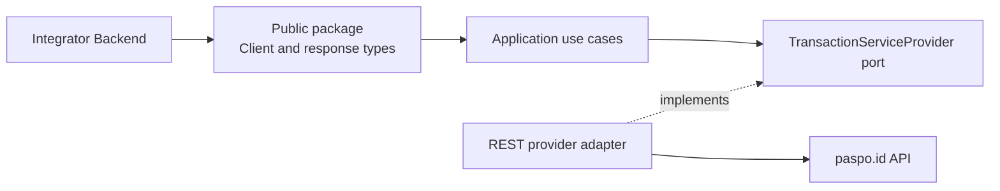

# server-api-go Architecture and Documentation Guide

## 1. Purpose of this document

This document is the architectural source of truth for the
`github.com/paspoid/server-api-go` repository.

It is intended for developers and coding agents that change the SDK. It
describes:

- the responsibility and boundaries of the SDK;
- the public API and compatibility guarantees;
- the internal Clean Architecture layers;
- the runtime flow of `GetKey` and `Validate`;
- HTTP transport behavior;
- security and error-handling rules;
- testing and extension procedures;
- mandatory rules for maintaining `README.md`.

When implementation and documentation differ, inspect the current code first,
then update both the code and this document in the same change. Do not leave a
known mismatch between the public API, the README examples, and the actual
transport payloads.

## 2. Project identity

| Item | Value |
| --- | --- |
| Product brand | `paspo.id` |
| Go module | `github.com/paspoid/server-api-go` |
| Public Go package | `paspoid` |
| Minimum language version | Go `1.24` as declared in `go.mod` |
| License | MIT |
| Primary upstream service | paspo.id Transaction and Authentication Service |
| Transport | JSON over HTTPS |

### Branding rules

- Human-readable product text must use `paspo.id`.
- Do not write `PASPOID` or `Paspoid` as the product brand.
- Technical identifiers must not be renamed only for branding:
  - the Go package remains `paspoid`;
  - the module path remains `github.com/paspoid/server-api-go`;
  - environment variables remain `PASPOID_*` until a versioned configuration
    migration is intentionally introduced.

## 3. Scope

The SDK is a backend-only Go client for two external API operations:

1. obtain a one-time transaction key through `GetKey`;
2. check the state of that key through `Validate`.

The SDK is responsible for:

- storing API credentials inside a constructed client;
- translating the public Go API into application DTOs;
- delegating operations through an application port;
- sending authenticated JSON requests to the paspo.id API;
- decoding successful JSON responses;
- propagating context cancellation and transport/protocol errors;
- hiding internal implementation packages from SDK consumers.

The SDK is not responsible for:

- provisioning API credentials;
- encrypting or decrypting credentials stored by paspo.id services;
- maintaining server-side nonce or authentication state;
- implementing frontend or mobile authentication flows;
- automatically polling `Validate`;
- automatically retrying failed HTTP requests;
- billing, service authorization, IP allowlisting, or transaction processing;
- loading `.env` files for library consumers;
- logging or persisting user credentials.

`examples/main.go` may load `.env` for local demonstration purposes. That
behavior belongs to the example program, not to the SDK.

## 4. High-level architecture

The repository applies a small Clean Architecture / Hexagonal Architecture
layout:



The dependency direction points inward:

```text
consumer
   ↓
public package
   ↓
application use cases
   ↓
application ports
   ↑
infrastructure adapter
   ↓
remote HTTP API
```

The application layer defines what it needs. Infrastructure supplies the
implementation.

## 5. Repository structure

```text
server-api/
├── .agent/
│   └── ARCHITECTURE.md
├── .env.example
├── LICENSE
├── README.md
├── client.go
├── responses.go
├── examples/
│   └── main.go
├── internal/
│   ├── application/
│   │   ├── dto/
│   │   │   ├── get_key.go
│   │   │   └── validate.go
│   │   ├── ports/
│   │   │   └── providers/
│   │   │       ├── transaction_service.go
│   │   │       ├── requests/
│   │   │       │   └── transaction_service.go
│   │   │       └── responses/
│   │   │           └── transaction_service.go
│   │   └── use_cases/
│   │       ├── get_key.go
│   │       └── validate.go
│   └── infrastructure/
│       └── adapters/
│           └── providers/
│               └── rest/
│                   └── transaction_service.go
├── go.mod
└── go.sum
```

Temporary diagnostic programs may exist under `tmp/`, but they are not part of
the SDK architecture, public API, release artifact, or documentation contract.
Do not base production code on `tmp/` utilities.

## 6. Layer responsibilities

### 6.1 Public package

Files:

- `client.go`
- `responses.go`

Responsibilities:

- expose the supported SDK surface;
- construct the configured SDK client;
- accept caller-owned `context.Context` values;
- map public method parameters into application DTOs;
- map application outputs into public response types;
- keep all internal packages inaccessible to external consumers.

The public package currently exports:

```go
func NewClient(baseUrl, apiKey, apiSecret string) *Client

func (c *Client) GetKey(
    ctx context.Context,
    servicePublicId string,
    transactionType string,
) (*GetKeyResponse, error)

func (c *Client) Validate(
    ctx context.Context,
    nonce string,
) (*ValidateResponse, error)
```

Exported methods and response fields are a semantic-versioning contract.
Changing a method signature, removing a field, or changing a field type is a
breaking change.

### 6.2 Application DTOs

Directory:

- `internal/application/dto`

Responsibilities:

- represent inputs and outputs used by application use cases;
- remain independent from HTTP request construction;
- contain no network, logging, filesystem, or environment logic.

Current DTO flow:

```text
GetKeyInput  -> GetKeyUseCase  -> GetKeyOutput
ValidateInput -> ValidateUseCase -> ValidateOutput
```

The current `GetKeyInput` contains API credential fields because the public
client owns those credentials. The REST provider also stores the credentials
at construction time and injects them into the remote request. Do not introduce
another credential source without first simplifying and documenting this
ownership model.

### 6.3 Application use cases

Directory:

- `internal/application/use_cases`

Responsibilities:

- orchestrate one application operation;
- depend only on application DTOs and ports;
- map port request and response types;
- propagate errors without transport-specific branching.

Current use cases are intentionally thin:

- `GetKeyUseCase.Execute`
- `ValidateUseCase.Execute`

Business rules such as IP checks, billing, credential verification, nonce
expiration, and validation status calculation belong to the remote service,
not to these SDK use cases.

### 6.4 Application ports

Directory:

- `internal/application/ports/providers`

The central outbound port is:

```go
type TransactionServiceProvider interface {
    GetKey(
        ctx context.Context,
        req requests.GetKeyRequest,
    ) (*responses.GetKeyResponse, error)

    Validate(
        ctx context.Context,
        req requests.ValidateRequest,
    ) (*responses.ValidateResponse, error)
}
```

Responsibilities:

- define the capabilities required by the application;
- isolate use cases from REST implementation details;
- provide a test seam for mock or fake implementations.

Rules:

- application ports must not import infrastructure packages;
- request and response port types must model the upstream JSON contract;
- infrastructure adapters may import and implement application ports;
- adding a new remote operation requires updating the interface and every
  implementation.

### 6.5 Infrastructure REST adapter

File:

- `internal/infrastructure/adapters/providers/rest/transaction_service.go`

Responsibilities:

- normalize the base URL by removing trailing `/`;
- retain API credentials for authenticated requests;
- create HTTP requests with the caller's context;
- set JSON request headers;
- execute requests through `net/http`;
- limit response reads to 1 MiB;
- classify all `2xx` responses as successful;
- include non-`2xx` response status and body in returned errors;
- decode JSON into port response types.

The adapter must not expose itself publicly. Consumers interact with `Client`,
not with `transactionServiceRestProvider`.

## 7. Public data contracts

### 7.1 GetKeyResponse

```go
type GetKeyResponse struct {
    Key              string `json:"key"`
    ValidationWindow string `json:"validation_window"`
}
```

Field semantics:

- `Key` is a one-time transaction key, also called a nonce.
- `ValidationWindow` is a Go duration string such as `30s`.
- The validation window describes the server-side lifetime of the key.
- The SDK does not impose a polling strategy based on this value.

### 7.2 ValidateResponse

```go
type ValidateResponse struct {
    Status     string          `json:"status"`
    DataType   *string         `json:"data_type,omitempty"`
    DataValue  *string         `json:"data_value,omitempty"`
    PhoneData  json.RawMessage `json:"phone_data,omitempty"`
    DeviceData json.RawMessage `json:"device_data,omitempty"`
}
```

Status values:

| Status | Meaning |
| --- | --- |
| `incomplete` | The transaction has not been completed yet. |
| `success` | The transaction completed successfully. |
| `failed` | The transaction failed, expired, or could not be found. |

Optional fields may be absent or `nil`. Callers must check pointers before
dereferencing them.

`PhoneData` and `DeviceData` intentionally use `json.RawMessage`. This preserves
forward compatibility with upstream JSON objects without forcing the SDK to
version every nested server-side field. A future change to typed structures
must consider backward compatibility.

## 8. Remote HTTP contracts

### 8.1 GetKey

Request:

```http
POST /v1/ext/get-key
Content-Type: application/json
Accept: application/json
```

JSON payload:

```json
{
  "api_key": "<configured API key>",
  "api_secret": "<configured API secret>",
  "service_public_id": "<method argument>",
  "transaction_type": "<method argument>"
}
```

Known transaction types:

- `phones`
- `emails`
- `national_id`
- `pasport_id`
- `transaction_verify`
- `second_factor`

Successful response:

```json
{
  "key": "<one-time key>",
  "validation_window": "30s"
}
```

Credential placement is an infrastructure concern. API credentials must never
be added to public logs or errors by the SDK.

### 8.2 Validate

Request:

```http
POST /v1/ext/validate
Content-Type: application/json
Accept: application/json
```

JSON payload:

```json
{
  "nonce": "<key returned by GetKey>"
}
```

Successful protocol response:

```json
{
  "status": "incomplete"
}
```

or:

```json
{
  "status": "success",
  "data_type": "phones",
  "data_value": "<verified value>",
  "phone_data": {},
  "device_data": {}
}
```

or:

```json
{
  "status": "failed"
}
```

`Validate` performs one HTTP request per method call. The SDK does not contain
an internal loop, timer, background goroutine, or automatic follow-up request.

## 9. Runtime flows

### 9.1 Client construction

```text
NewClient(baseURL, apiKey, apiSecret)
    -> construct REST provider
    -> construct GetKey use case with provider
    -> construct Validate use case with provider
    -> return reusable Client
```

The client keeps credentials in private fields and in the private REST
provider. After construction, SDK state is effectively immutable.

### 9.2 GetKey flow

```text
Integrator
    -> Client.GetKey
    -> GetKeyInput
    -> GetKeyUseCase.Execute
    -> TransactionServiceProvider.GetKey
    -> REST POST /v1/ext/get-key
    -> provider response
    -> GetKeyOutput
    -> public GetKeyResponse
```

### 9.3 Validate flow

```text
Integrator
    -> Client.Validate
    -> ValidateInput
    -> ValidateUseCase.Execute
    -> TransactionServiceProvider.Validate
    -> REST POST /v1/ext/validate
    -> provider response
    -> ValidateOutput
    -> public ValidateResponse
```

The SDK returns the server-provided validation status. Interpretation of the
status remains explicit in consumer code.

## 10. Context, lifecycle, and concurrency

### Context

- Every public network method accepts `context.Context`.
- The context is passed to `http.NewRequestWithContext`.
- Cancellation and deadlines therefore propagate to DNS, connection, request,
  and response operations supported by `net/http`.
- Consumers should normally use `context.WithTimeout`.
- Do not replace caller contexts with `context.Background()` inside SDK
  layers.

### HTTP client

The current provider constructs:

```go
&http.Client{}
```

There is no SDK-level timeout. A request without a context deadline can wait
according to the default `net/http` behavior.

If configurable timeouts or a custom `http.Client` are added:

- preserve the existing `NewClient` API for backward compatibility;
- introduce functional options or an additional constructor;
- do not create a new `http.Client` per request;
- document defaults in `README.md`;
- add tests for timeout and cancellation behavior.

### Concurrency

The client contains no request-specific mutable state after construction, and
Go's `http.Client` is safe for concurrent use. A single SDK client should be
reused by an integrator instead of being constructed for every request.

Do not add mutable shared request state to `Client` or the provider without
synchronization and race tests.

## 11. Error model

The SDK currently returns ordinary wrapped Go errors rather than exported typed
errors.

Error categories include:

- JSON request serialization failures;
- request construction failures;
- context cancellation and HTTP execution failures;
- response read failures;
- non-`2xx` HTTP responses;
- JSON response decoding failures.

Non-`2xx` errors currently include the status code and trimmed response body:

```text
get-key returned status 401: {"message":"unauthorized"}
```

or:

```text
validate returned status 500: {"message":"internal server error"}
```

Rules:

- wrap errors with operation context using `%w` where an underlying error
  exists;
- never include API credentials in SDK-generated errors;
- keep response reads bounded;
- do not silently convert transport errors into validation statuses;
- do not treat `ValidateResponse.Status == "failed"` as a Go transport error;
- if exported typed errors are introduced, do so additively and document
  `errors.Is` / `errors.As` behavior.

## 12. Security requirements

### Credential handling

- The SDK is backend-only.
- API keys and API secrets must not be sent to browsers or mobile clients.
- Do not print credentials in examples.
- Do not log request bodies for `GetKey`.
- Do not include credentials in errors, metrics labels, traces, or test
  fixtures.
- Never commit real `.env` files or production credentials.
- `.env.example` must contain empty values or obvious placeholders only.

### Transport

- Production examples must use `https://paspo.id`.
- Do not disable TLS verification in SDK code or documentation.
- Do not add proxy-header spoofing, IP bypasses, or authentication bypasses to
  this repository.

### Responses

- A returned nonce is sensitive and short-lived.
- Avoid logging nonce values in production integrations unless explicitly
  required by a secure audit design.
- Treat `PhoneData`, `DeviceData`, and verified values as personal data.

### Dependencies

- Keep the dependency set small.
- Runtime SDK code currently relies on the Go standard library.
- `godotenv` is used only by the example and must not be required by library
  consumers.
- Review and justify every new direct dependency.

## 13. Adding or changing functionality

### Add a new SDK operation

Implement changes in this order:

1. Define internal port request and response types.
2. Add the method to `TransactionServiceProvider`.
3. Add an application DTO input and output.
4. Add a use case depending on the port.
5. Implement the REST adapter method.
6. Wire the use case in `Client`.
7. Add the public client method and public response type.
8. Add unit tests for use case mapping.
9. Add HTTP adapter tests using `httptest.Server`.
10. Add or update the example.
11. Update `README.md`.
12. Update this architecture document if a boundary or invariant changed.

### Change an existing remote payload

- Verify the upstream contract first.
- Keep JSON field names exact.
- Update port request/response types and adapter tests.
- Preserve exported public fields whenever possible.
- Treat removal or type changes in exported fields as breaking.
- Update README tables and examples in the same change.

### Add optional client configuration

Prefer functional options:

```go
client := paspoid.NewClient(
    baseURL,
    apiKey,
    apiSecret,
    // future options
)
```

Because the current constructor has three arguments, changing it directly to a
variadic option form can be source-compatible if designed carefully. Confirm
the public API and Go compatibility before release.

Potential future options:

- custom `http.Client`;
- request timeout;
- custom user agent;
- observability hooks;
- maximum response size.

Do not add automatic retries by default. `GetKey` may create state and cannot
be assumed idempotent without an upstream idempotency contract.

## 14. Testing strategy

The architecture provides a natural test pyramid.

### Use case unit tests

Use a fake `TransactionServiceProvider` to verify:

- request field mapping;
- response field mapping;
- error propagation;
- optional response fields.

### REST adapter tests

Use `httptest.Server` to verify:

- endpoint paths;
- HTTP methods;
- JSON payloads;
- API credential injection for `GetKey`;
- `Validate` nonce payload;
- request headers;
- trailing slash normalization;
- all `2xx` statuses are accepted;
- non-`2xx` status/body errors;
- invalid JSON response handling;
- context cancellation;
- response body size limit.

Never use production credentials in tests.

### Public API tests

Verify:

- constructor wiring;
- public-to-internal response mapping;
- nil optional fields;
- concurrent calls when concurrency behavior changes.

### Required validation commands

Run from the repository root:

```bash
gofmt -w <changed-go-files>
go test ./...
go vet ./...
```

For concurrency-related changes:

```bash
go test -race ./...
```

Before release, verify that the README quick-start program compiles against
the current module path.

## 15. README.md maintenance rules

`README.md` is public integration documentation. It is not an internal design
dump.

### Language and branding

- README content must be written entirely in English.
- Use `paspo.id` for the product brand.
- Keep code identifiers exact:
  - import path: `github.com/paspoid/server-api-go`;
  - package alias: `paspoid`;
  - environment variables: `PASPOID_BASE_URL`,
    `PASPOID_API_KEY`, `PASPOID_API_SECRET`,
    `PASPOID_SERVICE_PUBLIC_ID`, and
    `PASPOID_TRANSACTION_TYPE`.

### Required README sections

Maintain these sections:

1. project title and short purpose;
2. installation command using the module path from `go.mod`;
3. compilable quick-start example;
4. public API method documentation;
5. public response field tables;
6. local example environment variables;
7. external integration Mermaid diagram;
8. validation status descriptions;
9. short project structure overview;
10. MIT License link.

### Quick-start rules

- Use only public SDK APIs.
- Use `https://paspo.id` as the production base URL.
- Use placeholders for all credentials.
- Use a currently supported transaction type, normally `phones`.
- Demonstrate one `GetKey` request and one `Validate` request.
- Do not add a polling loop to the README quick start.
- Handle returned errors.
- Check pointer fields before dereferencing them.
- Keep the example concise enough for an external developer.

### Mermaid diagram rules

The public README diagram must remain integration-focused.

It should show only:

- Integrator Backend;
- paspo.id Go SDK;
- paspo.id API;
- client construction;
- one `GetKey` request and response;
- one `Validate` request and response.

It must not show:

- internal databases;
- Vault;
- go-admin;
- internal transaction-service packages;
- RingApp or an end-user flow;
- a polling loop;
- temporary diagnostic behavior;
- IP or credential bypasses.

The diagram and its labels must be in English.

### Validation status documentation

Always document all current statuses:

- `incomplete`;
- `success`;
- `failed`.

Describe status values as normal response data. Do not imply that every
`failed` status is an HTTP or Go error.

### Accuracy checks

Whenever public code changes, compare README content against:

- `go.mod` for the installation path;
- `client.go` for constructor and method signatures;
- `responses.go` for exported response fields;
- port request types for JSON request fields;
- port response types for JSON response fields;
- the REST adapter for endpoint paths;
- `.env.example` for environment variable names;
- `LICENSE` for the license statement.

Do not document features that are planned but not implemented.

### Security checks

Before committing README changes:

- search for real credentials;
- ensure examples contain placeholders;
- ensure no nonce, API secret, encrypted secret, or Vault key is present;
- ensure credentials are described as backend-only;
- ensure production URLs use HTTPS.

## 16. Versioning and compatibility

Follow semantic versioning for releases.

Examples of breaking changes:

- renaming `Client`, `GetKey`, or `Validate`;
- changing constructor arguments incompatibly;
- removing exported response fields;
- changing an exported field type;
- changing the module path;
- changing status semantics without an upstream versioned contract.

Examples of additive changes:

- adding a new public method;
- adding an optional response field;
- adding a new functional option with backward-compatible defaults;
- adding exported typed errors while retaining existing error behavior.

For a breaking change:

1. document the migration;
2. update all examples;
3. update the README;
4. update this architecture document;
5. release a new major version.

## 17. Known limitations and technical debt

The following describes the current implementation and should not be hidden by
documentation:

- the REST provider uses an unconfigured `http.Client` with no client-level
  timeout;
- callers must provide context deadlines for bounded requests;
- there are no exported typed API errors;
- there is no custom transport or `http.Client` injection;
- input validation is delegated to the remote API;
- request retries are not implemented;
- the SDK does not poll `Validate`;
- response nested objects are exposed as `json.RawMessage`;
- request and response models are repeated across public, DTO, and port layers;
- `GetKeyInput` contains credential fields that are not consumed by the use
  case because credentials are injected by the provider;
- there are currently no committed automated tests in the repository.

Address technical debt incrementally and preserve public compatibility.

## 18. Definition of done

A change is complete only when all applicable items are satisfied:

- [ ] Layer dependency rules are preserved.
- [ ] Public API compatibility has been evaluated.
- [ ] JSON and endpoint contracts match the upstream API.
- [ ] Credentials and personal data are not logged or committed.
- [ ] Changed Go files are formatted.
- [ ] `go test ./...` passes.
- [ ] `go vet ./...` passes for production changes.
- [ ] Tests cover new behavior.
- [ ] `README.md` matches the public API.
- [ ] Mermaid remains external-developer focused.
- [ ] README branding uses `paspo.id`.
- [ ] README examples contain no RingApp flow or polling loop.
- [ ] `LICENSE` and module-path references are correct.
- [ ] This document is updated when architecture or policy changes.
