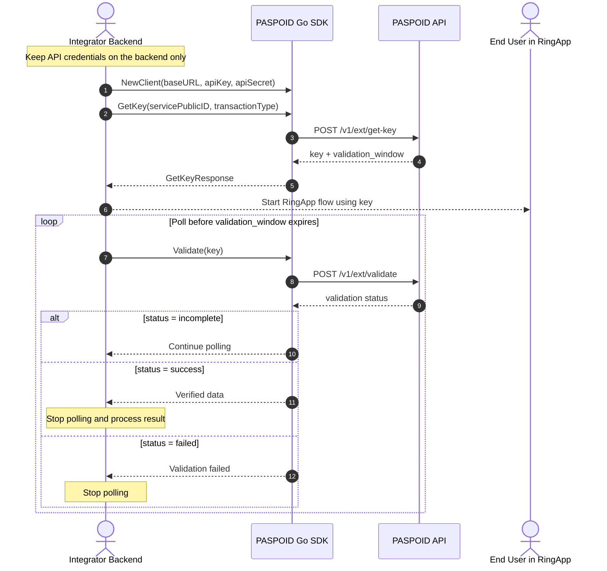

# Paspoid Server API Go SDK

Официальный Go SDK для интеграции с **Paspoid Server API** (Transaction & Authentication Service). 

Библиотека предоставляет удобный интерфейс для получения ключей транзакций и последующей валидации сессий/транзакций.

---

## 📦 Установка

```bash
go get github.com/paspoid/server-api@v0.1.0
```

---

## 🚀 Быстрый старт

```go
package main

import (
	"context"
	"fmt"
	"log"

	paspoid "github.com/paspoid/server-api"
)

func main() {
	// Инициализация клиента
	client := paspoid.NewClient(
		"https://api.paspoid.com", // Base URL
		"YOUR_API_KEY",           // API Key
		"YOUR_API_SECRET",        // API Secret
	)

	ctx := context.Background()

	// 1. Получение транзакционного ключа
	keyResp, err := client.GetKey(ctx, "YOUR_SERVICE_PUBLIC_ID", "auth")
	if err != nil {
		log.Fatalf("Ошибка получения ключа: %v", err)
	}

	fmt.Println("Transaction Key:", keyResp.Key)
	fmt.Println("Validation Window:", keyResp.ValidationWindow)

	// 2. Валидация транзакции по ключу / nonce
	valResp, err := client.Validate(ctx, keyResp.Key)
	if err != nil {
		log.Fatalf("Ошибка валидации: %v", err)
	}

	fmt.Println("Status:", valResp.Status)
	if valResp.DataType != nil {
		fmt.Println("Data Type:", *valResp.DataType)
	}
	if valResp.DataValue != nil {
		fmt.Println("Data Value:", *valResp.DataValue)
	}
}
```

---

## 🛠 Методы API

### `GetKey(ctx context.Context, servicePublicId, transactionType string) (*GetKeyResponse, error)`

Запрашивает временный транзакционный ключ и окно валидации для выполнения проверки.

- **Параметры:**
  - `ctx` — контекст исполнения `context.Context`.
  - `servicePublicId` — публичный ID сервиса.
  - `transactionType` — тип транзакции (например, `"auth"`).
- **Возвращает:** `*GetKeyResponse` или ошибку `error`.

#### Структура `GetKeyResponse`:
| Поле | Тип | Описание |
| :--- | :--- | :--- |
| `Key` | `string` | Временный ключ транзакции. |
| `ValidationWindow` | `string` | Временное окно, в течение которого ключ действителен. |

---

### `Validate(ctx context.Context, nonce string) (*ValidateResponse, error)`

Проверяет статус транзакции по `nonce` / ключу и возвращает подробные данные авторизации и устройства.

- **Параметры:**
  - `ctx` — контекст исполнения `context.Context`.
  - `nonce` — одноразовый ключ транзакции (`Key`).
- **Возвращает:** `*ValidateResponse` или ошибку `error`.

#### Структура `ValidateResponse`:
| Поле | Тип | Описание |
| :--- | :--- | :--- |
| `Status` | `string` | Статус проверки (например, `"success"`, `"failed"`). |
| `DataType` | `*string` | Тип переданных данных (опционально). |
| `DataValue` | `*string` | Значение переданных данных (опционально). |
| `PhoneData` | `json.RawMessage` | Расширенные данные по номеру телефона (JSON). |
| `DeviceData` | `json.RawMessage` | Данные устройства пользователя (JSON). |

---

## ⚙️ Переменные окружения (`.env`)

Для локальной разработки или запуска примера в папке `examples/` можно использовать `.env` файл:

```env
PASPOID_BASE_URL=http://localhost:8080
PASPOID_API_KEY=your_api_key_here
PASPOID_API_SECRET=your_api_secret_here
PASPOID_SERVICE_PUBLIC_ID=your_service_public_id
PASPOID_TRANSACTION_TYPE=auth
```

---

## 🔄 Схема интеграции



> `validation_window` — это срок жизни одноразового ключа, а не интервал
> polling. Выполняйте `Validate` с небольшим интервалом и остановите polling
> при статусе `success`, `failed` или после истечения окна.

---

## 📐 Архитектура проекта

Библиотека построена с соблюдением принципов **Clean Architecture (Hexagonal Architecture)**:

```text
server-api/
├── client.go                     # Публичная точка входа SDK (Client)
├── responses.go                  # Публичные DTO ответов (GetKeyResponse, ValidateResponse)
├── examples/                     # Примеры использования SDK
└── internal/                     # Внутренняя логика (скрыта от внешних вызовов)
    ├── application/              # Use Cases, DTO, Ports (Интерфейсы)
    └── infrastructure/           # Реализации адаптеров (REST HTTP-клиент)
```

---

## 📄 Лицензия

MIT License
