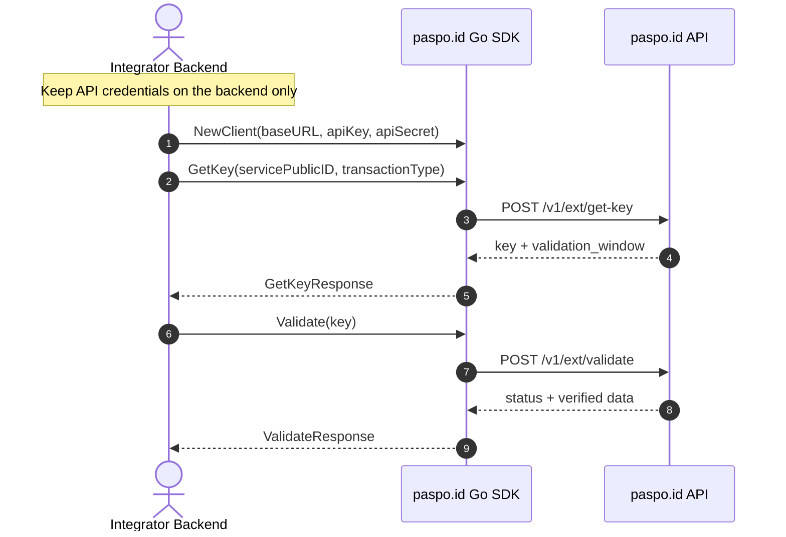

# paspo.id Server API Go SDK

The official Go SDK for integrating with the **paspo.id Server API**
(Transaction and Authentication Service).

The SDK provides a convenient interface for obtaining transaction keys and
validating authentication sessions and transactions.

---

## 📦 Installation

```bash
go get github.com/paspoid/server-api@v0.1.0
```

---

## 🚀 Quick Start

```go
package main

import (
	"context"
	"fmt"
	"log"

	paspoid "github.com/paspoid/server-api"
)

func main() {
	// Initialize the client. Keep these credentials on the backend only.
	client := paspoid.NewClient(
		"https://paspo.id", // Base URL
		"YOUR_API_KEY",     // API Key
		"YOUR_API_SECRET",  // API Secret
	)

	ctx := context.Background()

	// 1. Obtain a one-time transaction key.
	keyResp, err := client.GetKey(
		ctx,
		"YOUR_SERVICE_PUBLIC_ID",
		"phones",
	)
	if err != nil {
		log.Fatalf("failed to get key: %v", err)
	}

	fmt.Println("Transaction Key:", keyResp.Key)
	fmt.Println("Validation Window:", keyResp.ValidationWindow)

	// 2. Check the transaction status using the returned key.
	valResp, err := client.Validate(ctx, keyResp.Key)
	if err != nil {
		log.Fatalf("failed to validate transaction: %v", err)
	}

	fmt.Println("Status:", valResp.Status)
	if valResp.DataType != nil {
		fmt.Println("Data Type:", *valResp.DataType)
	}
	if valResp.DataValue != nil {
		fmt.Println("Data Value:", *valResp.DataValue)
	}
}
```

---

## 🛠 API Methods

### `GetKey(ctx context.Context, servicePublicId, transactionType string) (*GetKeyResponse, error)`

Requests a temporary transaction key and its validation window.

**Parameters:**

- `ctx` — request context.
- `servicePublicId` — public identifier of the configured service.
- `transactionType` — requested transaction type. Supported values:
  - `phones`
  - `emails`
  - `national_id`
  - `pasport_id`
  - `transaction_verify`
  - `second_factor`

**Returns:** `*GetKeyResponse` or an `error`.

#### `GetKeyResponse`

| Field | Type | Description |
| :--- | :--- | :--- |
| `Key` | `string` | Temporary one-time transaction key (nonce). |
| `ValidationWindow` | `string` | Duration for which the key remains valid, such as `30s`. |

---

### `Validate(ctx context.Context, nonce string) (*ValidateResponse, error)`

Checks the transaction status using the one-time key and returns verified
authentication and device data when available.

**Parameters:**

- `ctx` — request context.
- `nonce` — one-time transaction key returned by `GetKey`.

**Returns:** `*ValidateResponse` or an `error`.

#### `ValidateResponse`

| Field | Type | Description |
| :--- | :--- | :--- |
| `Status` | `string` | Validation status: `incomplete`, `success`, or `failed`. |
| `DataType` | `*string` | Type of verified data, when available. |
| `DataValue` | `*string` | Verified value, when available. |
| `PhoneData` | `json.RawMessage` | Extended phone and SIM information as JSON. |
| `DeviceData` | `json.RawMessage` | User device information as JSON. |

---

## ⚙️ Environment Variables

For local development or for running the application in `examples/`, create a
`.env` file:

```env
PASPOID_BASE_URL=https://paspo.id
PASPOID_API_KEY=your_api_key_here
PASPOID_API_SECRET=your_api_secret_here
PASPOID_SERVICE_PUBLIC_ID=your_service_public_id
PASPOID_TRANSACTION_TYPE=phones
```

Never expose the API key or API secret to browser or mobile applications.

---

## 🔄 Integration Flow



`ValidateResponse.Status` can contain:

- `incomplete` — the transaction has not been completed yet;
- `success` — the transaction was completed successfully;
- `failed` — the transaction failed, expired, or could not be found.

---

## 📐 Project Architecture

The SDK follows **Clean Architecture (Hexagonal Architecture)** principles:

```text
server-api/
├── client.go                     # Public SDK entry point
├── responses.go                  # Public response DTOs
├── examples/                     # SDK usage examples
└── internal/                     # Internal implementation
    ├── application/              # Use cases, DTOs, and ports
    └── infrastructure/           # REST transport adapter
```

---

## 📄 License

Distributed under the MIT License. See [LICENSE](LICENSE) for details.
